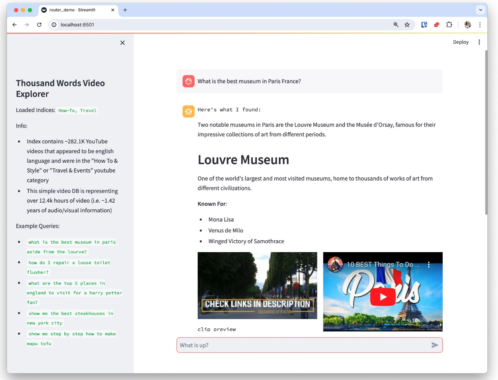
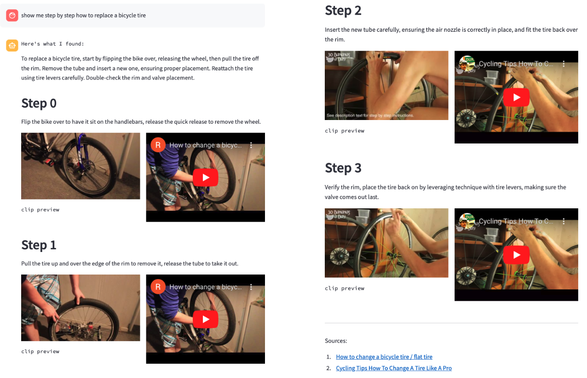
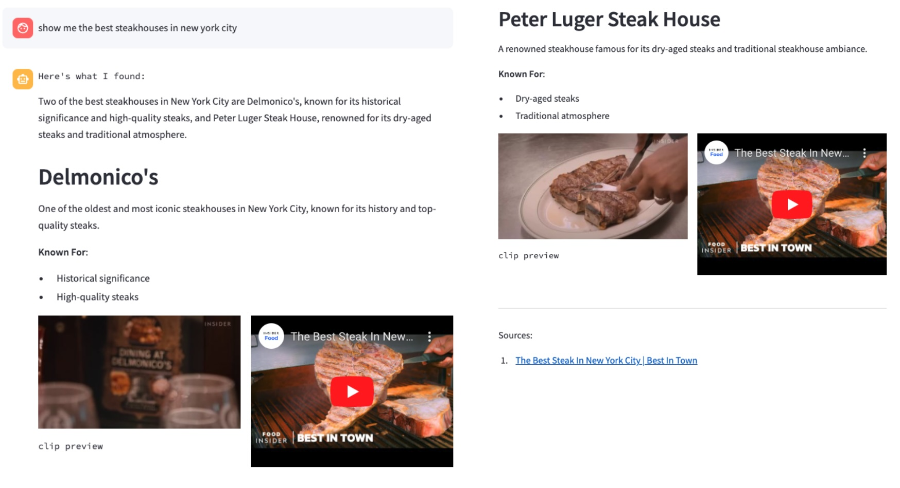
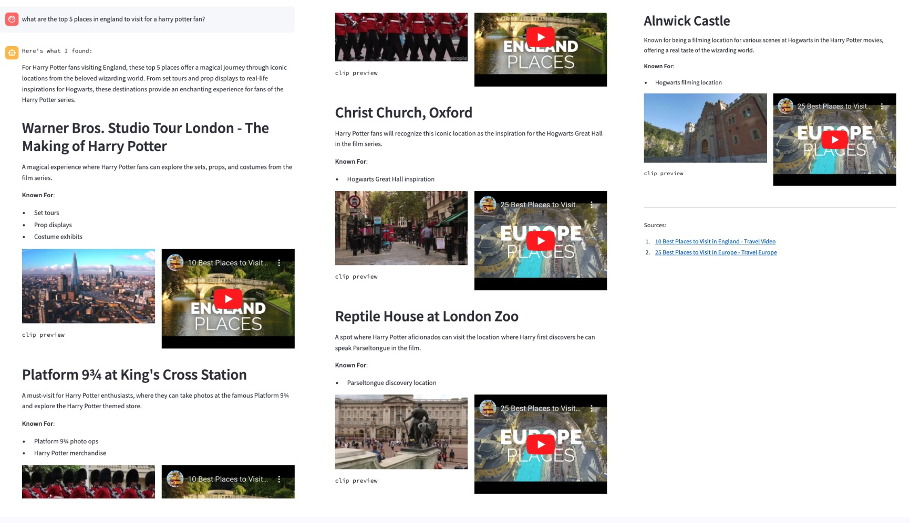
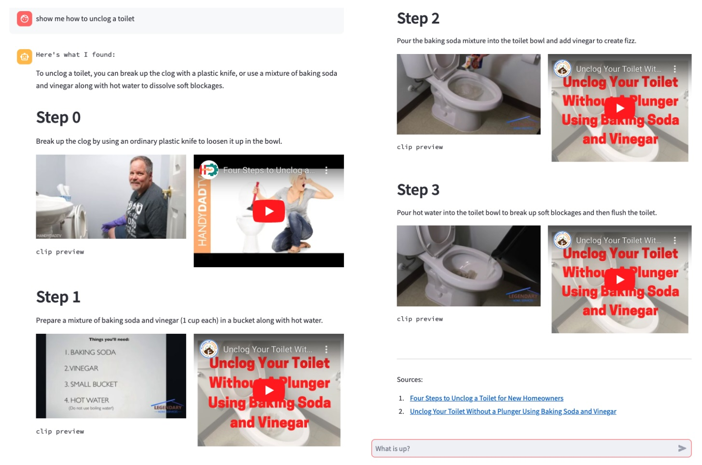

# Video Enriched Retrieval Augmented Generation Using Aligned Video Captions

In this work, we propose the use of ”aligned visual captions” as a mechanism for integrating information contained within videos into retrieval augmented generation (RAG) based chat assistant systems. These captions are able to describe the visual and audio content of videos in a large corpus while having the advantage of being in a textual format that is both easy to reason about & incorporate into large language model (LLM) prompts, but also typically require less multimedia content to be inserted into the multimodal LLM context window, where typical configurations can aggressively fill up the context window by sampling video frames from the source video. Furthermore, visual captions can be adapted to specific use cases by prompting the original foundational model / captioner for particular visual details or fine tuning. In hopes of helping advancing progress in this area, we curate a dataset and describe automatic evaluation procedures on common RAG tasks.

[Kevin Dela Rosa](https://perhaps.ai/) [](https://twitter.com/kdrwins) [](https://www.linkedin.com/in/kdrosa/) [](https://github.com/kdr) [](https://scholar.google.com/citations?user=8Pc5MiUAAAAJ&hl=en)

Presented at the 1st Workshop on Multimodal Representation and Retrieval ([MRR 2024](https://mrr-workshop.github.io/)) @ [SIGIR 2024](https://sigir-2024.github.io/)

[Presentation Slides](https://docs.google.com/presentation/d/105fSXZY7yPy7c8Iyc-LYOnGAs2pOKdAUptzHSqj2s5g/edit#slide=id.p)

[](https://arxiv.org/abs/2405.17706)

## Highlights

### Aligned Video Captions for Video Representation

*Aligned Video Caption Transcripts* are temporally synced scene descriptions of a video in the form of machine generated visual captions and the associated subtitles or automatic speech recognition transcripts. Aligned visual captions provide a compelling and adaptable representation of video information that can easily plug into basic LLM application architectures.


### Curated Dataset for Video Retrieval Augmented Generation

We curated a dataset based on public youtube videos sampled from [Panda-70M](https://snap-research.github.io/Panda-70M/), which contains individual clip segments and a general visual scene caption learned from a set of open source video captioning models. Specifically we sampled roughly 2,000 videos from each of 15 top level YouTube categories, resulting in a dataset of 29,259 videos (1.5M video clips and corresponding visual captions) or roughly 215 days of footage. We then augmented that dataset with subtitles gathered directly from YouTube’s APIs and created the aligned transcripts.

**Statistics for Aligned Video Caption Dataset**

| **DATASET DIMENSION**     | **TOTAL**    | **MEDIAN**  |
|---------------------------|--------------|-------------|
| Video Count               | 29,259       | -           |
| Scene Count               | 1,476,462    | 31.00       |
| Video Duration (seconds)  | 18,584,396   | 478.00      |
|                           |              |             |
| **Text Character Length** |              |             |
|                           |              |             |
| Title                     | 1,548,810    | 51.00       |
| Description               | 30,565,705   | 780.00      |
| Title + Description       | 32,114,515   | 833.00      |
| Visual Video Captions     | 96,888,187   | 2,016.00    |
| Subtitles / ASR           | 141,926,062  | 3,472.00    |
| Aligned Captions          | 276,019,918  | 6,461.00    |

We explored the feasibility of using text embeddings derived from video data as input for retrieval-augmented generation (RAG) to answer general knowledge questions. In our experiment, we used 1,000 general knowledge questions generated via GPT-4 V as input for an embedding extractor. We compared the retrieval results using two multimodal embeddings: [BLIP-2](https://arxiv.org/abs/2301.12597)’s image feature extractor and [CLIP](https://openai.com/index/clip/) embeddings. For retrieval, we calculated the top K results based on cosine similarity against a dataset of 29K videos. The top K results were then evaluated using GPT-4 as an automatic judge. To generate the questions we first sampled 500 videos from the dataset, then provided the aligned video captions as context to GPT 4 and asked the LLM to generate general knowledge questions that the video could help answer but are not specifically tied to the source video, and from the resulting question set we uniformly sampled 1000 questions.

**Video retrieval results and average quality (scored 1-10) of answer generated using aligned visual action of top retrieved document**

| **EMBEDDING**                  | **DATABASE**         | **HIT@1** | **HIT@5** | **HIT@10** | **QUALITY@1** |
|--------------------------------|----------------------|-----------|-----------|------------|---------------|
| **Multimodal Embeddings: Cross-modal Text to Vision Match** | | | | | |
| BLIP-2                         | Video Frames         | 0.482     | 0.801     | 0.895      | 5.199         |
| BLIP-2                         | Video Thumbnail      | 0.519     | 0.833     | 0.902      | 5.598         |
| CLIP ViT-L/14@336px            | Video Frames         | 0.542     | 0.858     | 0.925      | 5.785         |
| CLIP ViT-L/14@336px            | Video Thumbnail      | 0.553     | 0.859     | 0.926      | 5.889         |
| **Text Embeddings**            |                      |           |           |            |               |
| text-embedding-3-small         | ASR                  | 0.741     | 0.936     | 0.969      | 7.424         |
| text-embedding-3-small         | Visual Captions      | 0.650     | 0.878     | 0.932      | 6.605         |
| text-embedding-3-small         | Title                | 0.629     | 0.905     | 0.950      | 6.503         |
| text-embedding-3-small         | Title + Description  | 0.675     | 0.914     | 0.950      | 6.828         |
| text-embedding-3-small         | Aligned Transcript   | 0.741     | 0.934     | 0.971      | 7.377         |


### Architecture of Video Enriched Chat Bot


Here we illustrate the main components in a RAG-based AI chat bot application that leverages the aligned video captions to return relevant answers and corresponding video clip sources. The processing is as follows:

1. Based on the user query and a choice of tool descriptions, one retriever tool is selected; we created different tools that point to specific subsets of the video catalog.

2. The selected query engine tool vectorizes the query and searches the vector database to retrieve (chunked) aligned video caption text blobs.

3. The query engine tool interprets the results and summarizes them into a specific pydantic format customized for that answer type. For example, a "how to" response should respond with a bulleted list of steps like in Figure 2, whereas a "place" response would describe a location and why it is notable. Timestamps in retrieved docs help give the application pointers to specific parts of the video to enhance user interaction.

## Aligned Video Caption Dataset V1

**Dataset Artifacts**

| Artifact                                       | Download                                                                                           |
|------------------------------------------------|----------------------------------------------------------------------------------------------------|
| Video Ids                                      | [link](https://drive.google.com/file/d/1L61XvG_dfBOHFl1gKhTb2SW_5f_3acF4/view?usp=sharing) (343KB) |
| Aligned Video Captions + Limited Metadata      | [link](https://drive.google.com/file/d/1tWLYMIRfge7l3oQ55Fyi8Q5toWxhGvby/view?usp=sharing) (602MB) |
| Generated Questions from RAG feasibility Study | [link](https://drive.google.com/file/d/1DsITfhk2AVOWnwOywGUKmP0gXWbDnOjq/view?usp=sharing) (252KB) |

If you wish to download the original videos and full video metadata, follow instructions from [here](https://github.com/snap-research/Panda-70M/tree/main/dataset_dataloading). The ChatGPT prompts used for generating video summaries, questions, and automatic judging are provided in [prompts](prompts/LLM_PROMPTS.xlsx) folder.

Stay tuned for follow up works using this dataset!

## Demo

In order to demonstrate the integration of aligned video captions with a Video Enriched RAG-based AI chat bot, a demo application code is provided in [demo](demo/router_demo.py). For this we make use of all (auto-detected) english language videos from the full [Panda-70M](https://snap-research.github.io/Panda-70M/) restricted to the "How To & Style" or "Travel & Events" YouTube categories (~282.1K YouTube videos representing ~1.42 years of audio/visual information). Demo deployed online [here](https://kdr-yt282k-router.streamlit.app/).



### Example Results

1. `show me step by step how to replace a bicycle tire`
  

2. `show me the best steakhouses in new york city`
  

3. `show me step by step how to make mapu tofu`
  

4. `what are the top 5 places in england to visit as a harry potter fan`
  

5. `show me how to unclog a toilet`
  

6. `What is the best museum in Paris France?`
  

## Citation

```BibTeX
@article{rosa2024videoenrichedretrievalaugmented,
      title={Video Enriched Retrieval Augmented Generation Using Aligned Video Captions}, 
      author={Kevin Dela Rosa},
      year={2024},
      eprint={2405.17706},
      archivePrefix={arXiv},
      primaryClass={cs.AI},
      url={https://arxiv.org/abs/2405.17706}, 
}
```
